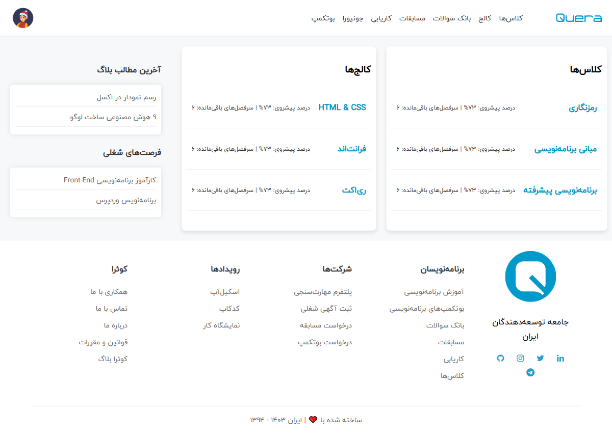
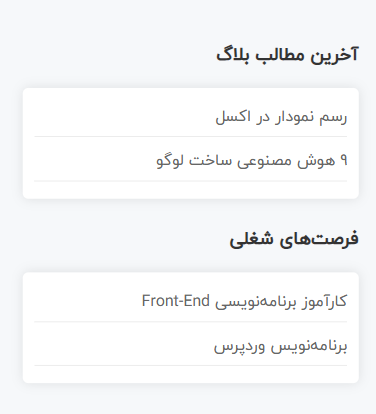
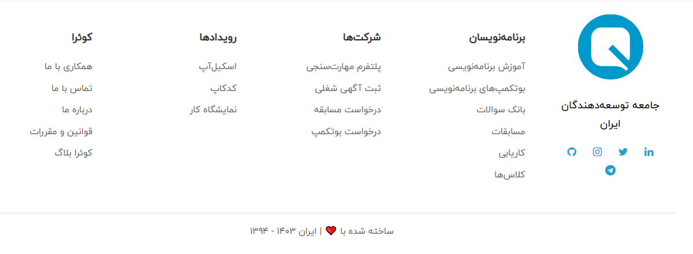

# 🎓 Quera Dashboard

A minimalist, RTL-friendly frontend clone of Quera's dashboard built purely with HTML and CSS.

[](LICENSE)
[](#)
[](#)
[](https://github.com/HesamOdinAbbaspour/quera-dashboard-clone/stargazers)


---

## ✨ Features

- 🎨 Clean UI inspired by Quera platform
- 📐 Fully RTL layout
- 💡 Uses custom Persian font (IranYekan)
- 🔧 Built with pure HTML & CSS – no libraries or frameworks
- 📁 Organized project structure
- 🧪 Great for practicing grid layouts and RTL design

---

## 📸 Screenshots

> Add screenshots here:  

| Dashboard View | Sidebar | Footer |
|----------------|---------|--------|
|  |  |  |

---

## 🚀 Getting Started

Clone the repository and open the project in your browser.

```bash
git clone https://github.com/yourusername/quera-dashboard-clone.git
cd quera-dashboard-clone
open index.html

