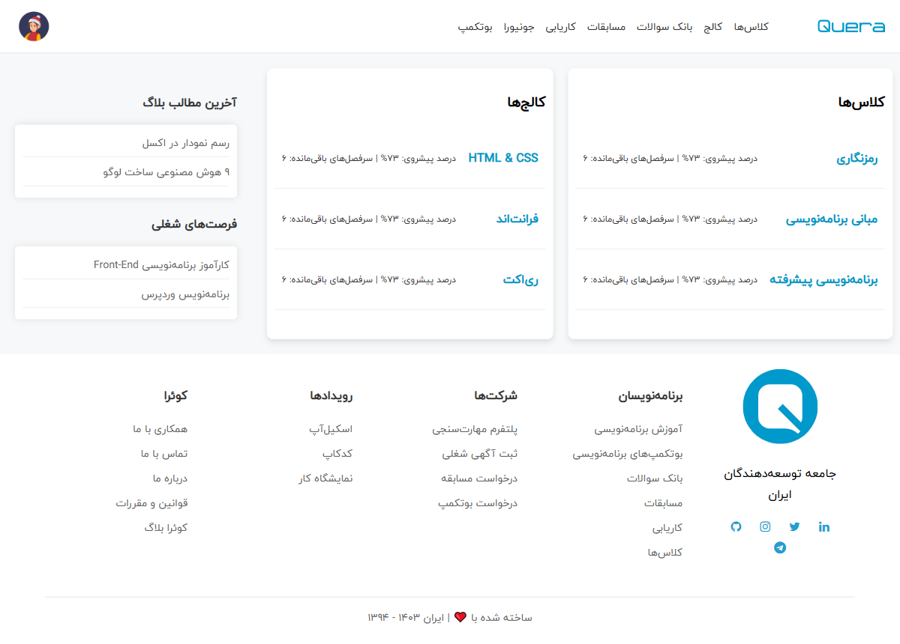

# 🎓  داشبورد Quera

یک رابط کاربری ساده، حرفه‌ای و راست‌چین از داشبورد Quera، طراحی‌شده فقط با HTML و CSS — بدون استفاده از هیچ کتابخانه یا فریم‌ورکی.

[](LICENSE)
[](#)
[](#)
[](https://github.com/HesamOdinAbbaspour/quera-dashboard/stargazers)

---

## ✨ ویژگی‌ها

- 🎨 طراحی الهام‌گرفته از رابط کاربری سایت کوئرا
- 📐 ساختار کامل راست‌چین (RTL)
- 🔠 استفاده از فونت فارسی ایران‌یکان
- 💡 پیاده‌سازی فقط با HTML و CSS خالص
- 🧰 مناسب برای تمرین UI، طراحی Grid و نمونه‌کارهای ساده

---

## 📸 تصاویر پروژه

| نمای کلی داشبورد | سایدبار | فوتر |
|------------------|---------|-------|
|  |  |  |


---

## 🚀 شروع سریع

مخزن را کلون کرده و فایل `index.html` را در مرورگر باز کنید:

```bash
git clone https://github.com/HesamOdinAbbaspour/quera-dashboard-clone.git
cd quera-dashboard-clone
open index.html
